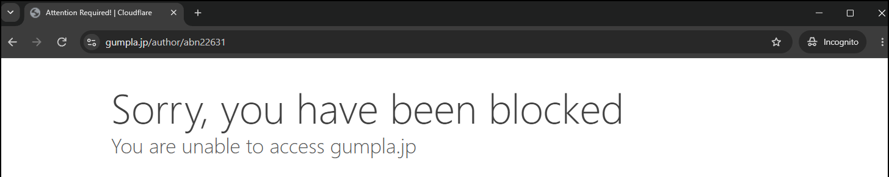

I'm fairly comfortable reading people and much less comfortable reading pixels, and this level needed both. The forensic half kept punishing me for guessing the obvious encoding. The OSINT half was where a psychology background finally helped, since it's mostly patient tracing of what a real person left in public. I got through it more by being stubborn than clever.

## The challenge

> After encountering a few of The Singularity's minions, I got paranoid and started encoding URLs to my secret files with my custom encoding and printing it out. I might have forgotten the password, but I'm pretty sure the printer left it on the page somewhere.

The attached file is a single PNG, `printer-secret.png`. Printer tracking dots in the page background encode an archive password, and a colour-triangle barcode encodes the archive's URL. Inside the archive is a second stage, which is OSINT.

## Separate the two payloads

The colour histogram shows two things against the cream page (255,255,250). Pale-yellow pixels at (252,249,216) form eight faint 153x153 blocks around the margins, and eight saturated colours make up the tag in the middle.

The eight yellow blocks are identical. I decoded each one separately and took a majority vote, so I didn't have to be careful about antialiasing.

:::concept{id="machine-identification-code" title="Machine Identification Code"}
Colour laser printers and copiers stamp a near-invisible grid of pale yellow dots on every page, encoding the device serial number and a print timestamp for forensic tracing. The pattern is normally read as presence or absence of a dot at each lattice point. This challenge breaks that assumption.
:::

## Decode the dots by position

The dots sit on a 10-pixel lattice, and nearly every lattice position has a dot. That cost me time. Decoding presence/absence gives a solid rectangle with no structure. The bit is actually the dot's horizontal offset, either 0 px (on the lattice point) or 3 px right. Row 0 is a sync row of unshifted dots and column 0 a sync column, leaving rows 1-14 by columns 1-14, or 196 bits, which assemble into the archive password.

## Read the colour tag

The tag interior is x 366-833, y 696-1176: 36 bands of 36 triangles, alternating down-pointing and up-pointing, sampled at the centroid (one third down the band for down-pointing, two thirds for up-pointing).

The half-triangles clipped by the left and right borders are data too. If you drop them and read 34 per row, the whole stream desynchronises into garbage. Eight colours give 3 bits each; 1296 triangles is 3888 bits, or 486 bytes.

## Crib-drag the colour mapping

Statistics don't work here, and I wish I'd known why before spending hours on them. Only 69 of 486 bytes are text. The rest is random padding, which swamps byte entropy, character frequency and the ASCII "top bit is always zero" test, so each of them confidently rules out ASCII.

:::concept{id="crib-dragging" title="Known-plaintext crib drag"}
When you expect the plaintext to contain a known fragment (a "crib"), slide it across every position of the encoded stream. At each offset, read off the mapping the crib would imply, and reject any offset where that mapping is inconsistent (the same colour forced to mean two values). Usually exactly one offset survives, locating the message and recovering the key at once. It works where aggregate statistics fail, for example when most of the payload is random filler.
:::

I slid the 64-bit pattern of `https://` across the stream. At each offset I read off which colour would have to map to which 3-bit value, and threw the offset out if that mapping wasn't a consistent bijection. Exactly one position survived. It pinned 7 of the 8 colours, and the eighth got whatever value was left.

| Colour | RGB | Value |
|---|---|---|
| salmon | 243,120,118 | 0 |
| white | 255,255,255 | 1 |
| purple | 142,127,170 | 2 |
| black | 3,3,3 | 3 |
| green | 141,166,126 | 4 |
| blue | 131,179,218 | 5 |
| yellow | 244,212,96 | 6 |
| orange | 255,158,93 | 7 |

## Decode both channels

The full script is [solve.py](/code/my-printer-has-a-secret/solve.py).

```python
#!/usr/bin/env python3
"""TISC 2026 - My Printer has a Secret.
Input : printer-secret.png
Output: archive password (tracking dots) + archive URL (colour tag).
Deps  : pillow, numpy, scipy
"""
import re
import numpy as np
from PIL import Image
from scipy import ndimage

img = np.array(Image.open("printer-secret.png").convert("RGB")).astype(int)
R, G, B = img[:, :, 0], img[:, :, 1], img[:, :, 2]

# ---------- Part 1: printer tracking dots -> password ----------
# Pale-yellow dots (252,249,216) against cream ground (255,255,250).
dots = (R > 230) & (G > 230) & ((R + G) / 2 - B > 20)

lab, n = ndimage.label(dots)
cent = np.array(ndimage.center_of_mass(dots, lab, range(1, n + 1)))
size = np.array(ndimage.sum(dots, lab, range(1, n + 1)))
cent = cent[size >= 4]                       # drop antialiasing specks
cy, cx = cent[:, 0], cent[:, 1]

# The tile repeats 8x across the page; decode all and majority-vote.
BLOCKS = [(85, 240, 235, 400),   (710, 872, 262, 425),
          (96, 259, 518, 681),   (693, 856, 540, 700),
          (85, 247, 1180, 1342), (708, 870, 1208, 1371),
          (95, 258, 1485, 1648), (692, 855, 1511, 1674)]

grids = []
for x0, x1, y0, y1 in BLOCKS:
    sel = (cx >= x0) & (cx <= x1) & (cy >= y0) & (cy <= y1)
    X, Y = cx[sel], cy[sel]
    row = np.round((Y - Y.min()) / 10).astype(int)    # 10 px lattice
    g = np.full((16, 16), -1)
    for r in range(row.max() + 1):
        xs = np.sort(X[row == r])
        if len(xs) == 0:
            continue
        base = xs.min()
        for v in xs:
            d = v - base
            col = int(round(d / 10))
            # THE TRICK: the bit is the dot's horizontal nudge, not its presence.
            # sits on the lattice point -> 0, nudged 3 px right -> 1.
            if col < 16 and r < 16:
                g[r, col] = 1 if (d - col * 10) > 1.5 else 0
    grids.append(g)

stack = np.stack(grids)
merged = np.zeros((16, 16), int)
for i in range(16):
    for j in range(16):
        v = stack[:, i, j]
        v = v[v >= 0]
        merged[i, j] = int(round(v.mean())) if len(v) else -1

# Row 0 is a sync row, column 0 a sync column. Data = rows 1-14 x cols 1-14.
bits = "".join(str(b) for b in merged[1:15, 1:15].flatten())
password = "".join(chr(int(bits[i:i + 8], 2))
                   for i in range(0, len(bits) // 8 * 8, 8))

# ---------- Part 2: colour triangle tag -> URL ----------
PALETTE = {(243, 120, 118): 0, (255, 255, 255): 1, (142, 127, 170): 2,
           (3, 3, 3): 3, (141, 166, 126): 4, (131, 179, 218): 5,
           (244, 212, 96): 6, (255, 158, 93): 7}
cols = np.array(list(PALETTE.keys()))
vals = np.array(list(PALETTE.values()))

X0, X1, Y0, Y1 = 366, 834, 696, 1177         # tag interior
STEP = (X1 - X0) / 35.0                      # 36 triangles per band
BAND = (Y1 - Y0) / 36.0                      # 36 bands

def sample(px, py):
    patch = img[int(round(py)) - 1:int(round(py)) + 2,
                int(round(px)) - 1:int(round(px)) + 2].reshape(-1, 3)
    d = np.linalg.norm(patch[:, None, :] - cols[None, :, :], axis=2).argmin(1)
    u, c = np.unique(d, return_counts=True)
    return vals[u[c.argmax()]]

symbols = []
for b in range(36):
    top = Y0 + b * BAND
    # the half-triangle at the left edge IS data - dropping it desyncs the stream
    symbols.append(sample(X0 + 3, top + 2 * BAND / 3))
    for m in range(34):
        # even m = down-pointing (centroid 1/3 down), odd = up-pointing (2/3)
        symbols.append(sample(X0 + STEP + m * STEP,
                              top + (BAND / 3 if m % 2 == 0 else 2 * BAND / 3)))
    symbols.append(sample(X1 - 3, top + BAND / 3))    # right-edge half-triangle

stream = "".join(f"{v:03b}" for v in symbols)         # 1296 x 3 = 3888 bits
data = bytes(int(stream[i:i + 8], 2)
             for i in range(0, len(stream) // 8 * 8, 8))
url = re.search(rb"https?://[\x21-\x7e]+", data).group().decode()

print(f"password : {password}")
print(f"url      : {url}")
```

Output:

```text
password : sut0roberi1-fure!b4a_*=^
url      : https://printer-secret.chals.tisc26.ctf.sg/Fn8u92fhuiWAfeAfGu23dy.zip
```

The password is leetspeak romaji for "sutoroberi furebaa", strawberry flavour. The archive at that URL opens with it.

## OSINT pivot

The second half starts from a deleted Yahoo Auctions listing, `auctions.yahoo.co.jp/jp/auction/d500233180`. It asks for the seller's Flickr username, the colour of their trousers in a photo with their pet, and the model number on their shop's cover photo.

:::concept{id="passive-osint" title="Passive OSINT"}
Passive open-source intelligence means collecting only public data trails: archives, cached pages, profiles and images, with no messages, follows or purchases that would touch the subject. Most of the work is checking instead of eyeballing. You read where a link actually points rather than its visible text, and you sample real pixel values rather than trusting a thumbnail.
:::

The brief inside the downloaded archive set the rules of engagement:

> This is a strictly PASSIVE OSINT challenge. You are a ghost. You may look, but you must not touch.
>
> Players must NEVER message the seller on Yahoo, contact them on any social media, fill out the shop's "Contact Us" form, or add items to a shopping cart.
>
> Do not harass the target. Aggressive scraping is not necessary.

So I kept it passive the whole way. I didn't contact the seller, fill in forms, add anything to a cart or follow anyone.

:::note{title="OSINT on someone who might be real"}
I never found out whether this seller was a persona built for the challenge or a real hobbyist whose public accounts got picked as a target, so I treated them as real. That set some limits. I answered the three questions the brief asked and stopped there. I didn't go looking for a name, a face or where they live, even where the trail made that tempting. Publishing is a separate decision from solving, so this page keeps what the flag already contains and leaves out the account links and IDs that would turn my notes into a ready-made trail. The one scripted fetch past Cloudflare was a single request for a public page. The brief said aggressive scraping wasn't necessary, and it wasn't.
:::

**Deleted listing to real seller ID.** There is no Wayback snapshot, but the Japanese auction archive aucfan still has it at `aucview.aucfan.com/yahoo/d500233180/` (HGUC 1/144 陸戦型ジム ウェザリング, ran 15-22 Feb 2021). The seller shows up under an aucfan alias, which leads nowhere. The real ID leaks through the outbound "この出品者のその他のオークションを見る" link, which resolves to `auctions.yahoo.co.jp/seller/abn22631`. I only found it by reading the href.

**Seller ID to accounts.** Searching the seller ID turned up a profile on GUNSTA (a Gunpla build-sharing site), a profile on ARTHOBYCOMM and an X account, all under matching handles.

**Flickr.** The obvious Flickr URL for that handle 404s. The account sits under a numeric ID instead, and because no custom URL alias is set, the username (`abn2263123`) only shows up on its About page.

**Pet photo.** The ARTHOBYCOMM profile header is a photo of a cat with the owner's knee in frame. I sampled the trousers instead of trusting my eyes. Mean RGB across the neutral pixels is (60,61,65). R, G and B are roughly equal, so it's grey rather than navy or black. At thumbnail size the heather knit looks far lighter than it measures.

**Shop cover.** The GUNSTA profile links to a small BASE shop. There is no custom banner, so the cover is the one item image, and that image has its caption printed on it: MS-18E KÄMPFER, HG, Mobile Suit Gundam 0080 War in the Pocket.

## The flag

Format: `TISC{flickruser_colour_MODELNUMBER}`

```text
TISC{abn2263123_grey_MS-18E}
```

The three parts answer the three OSINT questions in order: Flickr username, trouser colour in the pet photo, and the model number on the shop's cover image.

:::note{title="Spelling"}
TISC is run from Singapore, so the British `grey` was my first guess. If it had been rejected, I would have tried `gray` before doubting the other two parts.
:::

## What didn't work

- **Presence/absence on the tracking dots.** Real printer MICs encode this way, so it's the natural first guess, and it gives you a solid block of dots. I only saw the offset encoding after plotting the dot centroids and noticing they cluster at two x-positions per lattice column.
- **Statistics on the colour tag.** I lost roughly two hours to entropy, chi-square by residue and the ASCII high-bit test. They all say the data isn't text, because the filler outweighs the payload six to one. If a payload might be sparse, try a crib drag first.
- **Dropping the edge half-triangles.** Reading 34 symbols per row instead of 36 gives a stream that looks plausible and decodes to nothing.
- **Fetch path matters.** `gumpla.jp` blocked me at Cloudflare even in Chrome, and I was halfway to setting up a VPN before I tried a plain HTTP fetch from a script, which went straight through. The deleted listing went the same way: `aucfree.com` and `zenmarket` both returned 403, and `aucview.aucfan.com` worked. I never needed the VPN, only a different route in. When one route is blocked, try another before deciding the data is gone.

  

  *Blocked in plain Chrome, even in Incognito. A script's plain HTTP fetch went straight through.*

- **ARTHOBYCOMM renders client-side**, so the profile looks empty unless you wait for it to load.

## Tools

Python (pillow, numpy, scipy), Wayback CDX API, aucfan archive, DuckDuckGo and Bing for username pivots, browser devtools for reading link targets and sampling image pixels.
