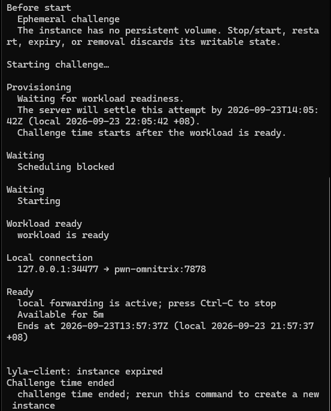

This was the last and hardest level of the event, and my first proper binary-exploitation chain from end to end. Programming has never been my strong suit, so getting here meant learning a lot of pwn along the way, and I wrote the beginner's account up separately. The short version is below, and the long, teach-it-to-yourself version is in [the workings](/levels/omnitrix/workings/).

## The challenge

Omnitrix is a custom binary TCP service. The real flag lives in an execute-only helper inside the challenge container that only prints it after you echo back a random token it generated. So the whole challenge is about getting code execution in that container to run the helper. The downloaded `omnitrix` binary is for reversing only, and the exploit runs against the live forwarded instance through the supplied connector.

## Reverse the wire protocol

Every message is a 16-byte big-endian header (`OMNI`, version, flags, opcode, request id, body length) followed by length-prefixed fields. Requests use `flags=0`, success `flags=1` and error `flags=3`. Reversing the auth path gives credentials `ben.tennyson` / `its-hero-time`, and authenticating with opcode `0x0010` returns a 16-byte session id.

```python
struct.pack(">4sBBHII", b"OMNI", version, flags, opcode, request_id, body_length)
field = lambda v: struct.pack(">H", len(v)) + v     # length-prefixed bytes
```

:::concept{id="capability-lease" title="Capability lease and revocation"}
Each privileged operation needs its own short-lived lease for a named capability (`matrix.configure`, `dna.shift`, `omnitrix.scan`), requested with opcode `0x0020` and revoked with `0x0021`. Ask for the wrong one and the error tells you which is missing.
:::

The diagnostic response (`0x0051`) is the oracle for the next stage: bytes 2-6 hold the policy mask, and the last eight bytes of the state block hold a generation counter.

## Race the policy mask

The privileged capability only unlocks when the policy mask reads `0x3f4`. Normal enhanced mode is `0x2a4`, and the extra `0x150` comes from a worker path that fires only when several things line up: mode 2 requested, an epoch mismatch, and a just-revoked lease still sitting in the stale capability cache.

:::concept{id="toctou-race" title="TOCTOU race"}
The service checks a lease, then a worker acts on it a moment later. Revoke the lease inside that gap and the worker reads it from stale cache after it's already gone, ORing the extra bits in. It's a classic time-of-check to time-of-use window.
:::

So I hold a `matrix.configure` lease, queue long `echo` "blocker" jobs on separate connections to keep workers busy and widen the window, then pipeline a batch of mode-2 changes and the revoke in a single `sendall` so the revoke arrives while the batch is still draining.

```python
batch = bytearray()
for _ in range(JOBS):                       # JOBS = 63
    batch += main_client.frame(0x50, matrix_lease + b"\x02")
batch += main_client.frame(0x21, matrix_lease)   # revoke, tail of the same buffer
main_client.sock.sendall(batch)
# then poll 0x0051 until the mask reads 0x3f4
```

It is scheduler-sensitive and misses often. It misses cleanly, so I kept the same connector port and retried.

:::note{title="The timer was a red herring"}
Each live instance lasts five minutes, and I let that panic me. I thought I had to keep the instance fresh and beat the clock, and I burned real time restarting and rushing. It was misdirection. The downloaded binary runs locally with no time limit, so you build and prove the entire chain there, and only point the finished race script at a live instance to run the actual race. The one catch is that the local copy lacks the real flag helper, so the final step has to be remote. Once I stopped racing the countdown and only raced the lease, the pressure went away.
:::



*Five minutes, then gone. I stopped fighting this once I did all the building locally.*


*A race attempt that missed: the mask stays at 0x2a4.*


*The race lands: policy mask reads 0x000003f4.*

## Inject the probe and read the flag

With the mask elevated, `dna.shift` grants the `codon.stream.inject` transform (`0x0041`), which writes files under `/tmp/omnitrix/codon`. The upload is validated as a real ELF first, so the payload has to be a genuinely clean shared object: `ET_DYN`, no `PT_INTERP`, no RWX segment, a `libc.so.6` dependency, real sections, an exported `omnitrix_probe`, and low raw-syscall density.

:::concept{id="so-injection" title="Shared-object injection"}
Get the service to load an attacker `.so` and call its exported function, and that function runs with the service's privileges inside its container. Once the payload passes the ELF validator, it can fork, exec the helper, and act as a foothold.
:::

I upload the probe and a small "OREP" replay strand, then recall it with opcode `0x0053` to run `omnitrix_probe` in the container. The probe tries the obvious helper paths, forks, execs the helper, and handles its token challenge.

:::concept{id="challenge-response" title="Challenge-response handshake"}
The execute-only helper prints `token: <16 hex>` and only prints the flag if it receives the same 16 bytes back. The probe reads the token as it is printed and echoes it straight back on the helper's stdin at runtime, since there's no way to know it in advance.
:::

```c
// probe.c: token handshake with the execute-only helper
marker = find_bytes(buffer, used, token_marker, 7);
if (marker >= 0 && used >= marker + 7 + 16)
    call3(1, input_pipe[1], (long)(buffer + marker + 7), 16);   // reply with same token
// then scan the helper's output for "TISC{" and write it to replay/result
```

The probe writes the captured flag back as a `chime` replay strand at `replay/result`, and `engage.py` polls it until the flag appears.

Four flag-shaped strings surfaced during reversing (`d14m0ndh34d_r4w_p0w3r`, `m4st3r_c0ntr0l_0v3rr1d3_gr4nt3d`, `v1lg4x_pr1m3_d1r3ct1v3`, and a base64 `upgr4d3_th3_0mn1tr1x`). All decoys.

:::concept{id="decoy-discipline" title="Decoy discipline"}
One decoy was a full sentence aimed at whoever was analysing the binary, telling them the challenge was over. A real flag never comes with a note telling you to stop looking. Only the string the protected helper prints counts.
:::


*The engage stage returns the real flag from the protected helper.*

The solve scripts are [`race_stage_remote.py`](/code/omnitrix/race_stage_remote.py), [`engage.py`](/code/omnitrix/engage.py) and [`probe.c`](/code/omnitrix/probe.c).

:::result{title="Flag"}
`TISC{6r33n_n33dl3_0r_br41n5t0rm??}` (the two trailing question marks are literal).
:::
