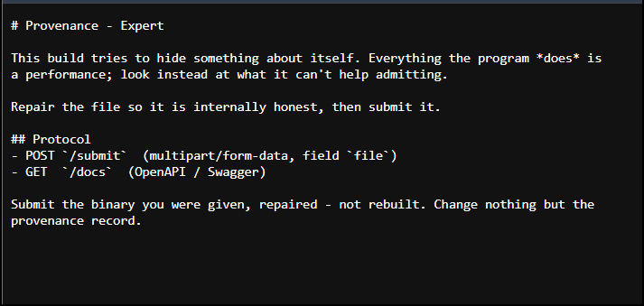
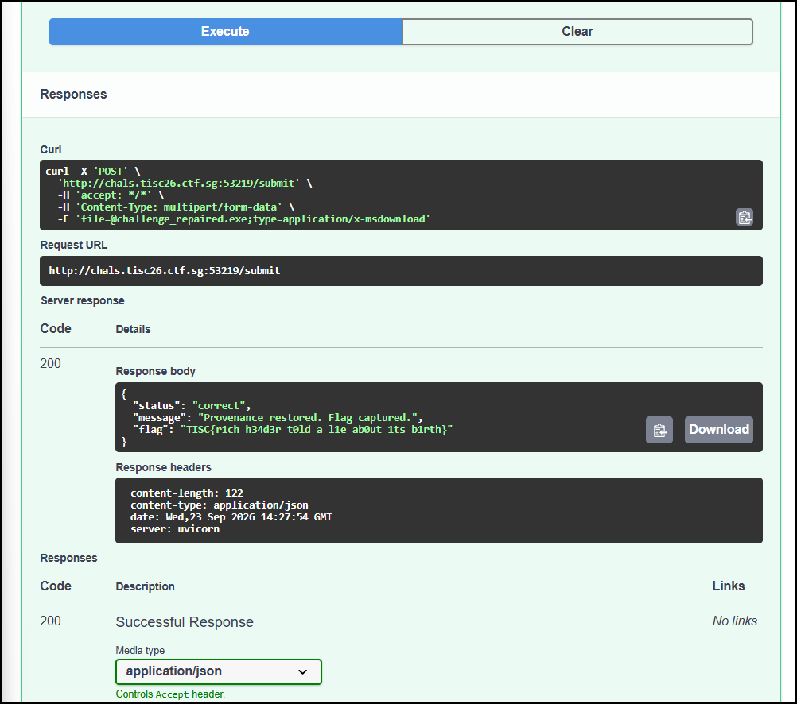

Reverse engineering is the part of security that intimidates me most, because staring at a binary feels like the opposite of reading a person. So I liked that this one rewarded patience over cleverness. The executable was quietly lying about its own past, and the job was to catch the lie and make it tell the truth.

## The challenge

> This build tries to hide something about itself. Everything the program does is a performance; look instead at what it can't help admitting. Make the binary honest about where it came from, then submit it to recover the flag.



*The brief. "Look instead at what it can't help admitting" turned out to be the whole level.*

The attachment was a single `challenge.exe`. The real check runs server-side: `POST` the repaired binary to `/submit`, with `/about` and `/docs` describing the flow.

## Learning it fast

PE internals were new to me. I knew an executable had headers, but I didn't know it carried a hidden, undocumented Rich header recording which tool builds produced it, let alone how its XOR mask and checksum worked. I leaned on Claude and ChatGPT to get up to speed on PE Rich headers and linker versions: what the Rich header is, how the checksum is computed, which byte ranges are excluded, and how build IDs map to Visual Studio versions. The judgement calls stayed with me, and this level punished skipping any of them.

The misdirection here comes in layers. The program prints a full, convincing flag on launch, and that flag describes itself as a decoy ("the flag comes only from submitting the correct binary"). Once you find the metadata lie, a second trap waits. There are two provenance records, and patching only the Rich header, or only the linker field, leaves the two contradicting each other, so the server rejects it as "not internally honest". Getting past both meant reading what the server actually verifies, not what the binary volunteers.

## Identify the decoy

Run `challenge.exe` and it decrypts a blob and prints a flag:

```text
TISC{r3m3mb3r_th3_fl4g_c0m3s_0nly_fr0m_subm1tt1ng_th3_c0rr3ct_b1n4ry}
```

The string names itself as a decoy, which is the author admitting the local output is bait. So I dropped it and looked at what the server wanted, which was the provenance metadata repaired and resubmitted.

:::concept{id="decoy-discipline" title="Decoy discipline"}
A flag a program hands you from static analysis is worth doubting, because the real one usually comes from the intended mechanism instead, which here is the server's honesty check. This one made it easy by naming itself as a decoy in plain text.
:::

## Find the lie

Parsing the PE header, `MajorLinkerVersion.MinorLinkerVersion` reads `14.10`, and the Rich header reports build `25017` on nine of its ten entries. Both point at VS2017. The binary's own features, though, are newer: it uses `std::format`, which first shipped in VS2019 16.10, and it carries a 320-byte load config with CastGuard and GuardMemcpy pointers. So the code is VS2022-era while both provenance records claim VS2017.

:::concept{id="rich-header" title="PE Rich header"}
An undocumented block between the DOS stub and the PE header, inserted by Microsoft's linker, recording which tool builds produced the object files, each with a count. It is XOR-masked with an additive checksum over the header bytes. Analysts use it to fingerprint a binary's true toolchain, so a forged one is exactly what a provenance check hunts for.
:::

:::concept{id="linker-version" title="PE linker version"}
A documented two-byte field in the PE optional header naming the linker that produced the file. It is a second, independent witness to provenance alongside the Rich header, and the server checks that the two agree.
:::

Submitting the file unmodified is rejected:

```json
{"status":"incorrect","message":"Rejected: the binary is still not internally honest."}
```

The two records already agree with each other (both VS2017), and the unmodified file is still rejected, so agreement alone isn't enough: they also have to match what the code actually is. Patching only one record then makes the two disagree as well. The fix is to update both to a VS2022 toolset that matches the code, build `35207` (MSVC 14.44.35207, which richprint labels as VS2022 17.14.0 Preview 7) and linker `14.44`.

## Repair both records, checksum included

The Rich header is not stored in plaintext. It is XOR-masked with a key that is itself a checksum over the file's own header bytes. The checksum starts from the DanS offset, adds each byte before DanS rotated left by its index (with the `e_lfanew` field counted as zero), then adds each comp.id rotated left by its count. It is additive, not a running XOR. Before trusting my implementation, I recomputed the existing checksum from scratch and checked it matched the value already in the file. Only then did I use the same routine to compute the new key.

```python
def rich_checksum(data, dans_off, pairs):
    chk = dans_off
    for i in range(dans_off):
        b = 0 if 0x3C <= i < 0x40 else data[i]   # e_lfanew field reads as zero
        chk = (chk + rol32(b, i)) & 0xFFFFFFFF
    for compid, count in pairs:
        chk = (chk + rol32(compid, count)) & 0xFFFFFFFF
    return chk

assert rich_checksum(data, dans_off, pairs) == old_key   # sanity-check first
new_key = rich_checksum(data, dans_off, new_pairs)
```

Then I bumped every VS2017 record to the new build, re-encrypted the block under the new key, and rewrote the two linker-version bytes to match:

```python
OLD_BUILD, NEW_BUILD = 25017, 35207   # 35207 == MSVC 14.44 (VS2022 17.14)
# ... rebuild the DanS block, re-XOR under new_key, write the trailing key dword ...
pe = pefile.PE(data=bytes(data))
oh_off = pe.OPTIONAL_HEADER.get_file_offset()
data[oh_off + 2] = 14   # MajorLinkerVersion
data[oh_off + 3] = 44   # MinorLinkerVersion
```

Only 101 bytes differ from the original: 100 in the Rich header block, plus the minor linker byte. The major linker byte was already 14, so it didn't need touching.

## Submit

```json
{"status":"correct","message":"Provenance restored. Flag captured.","flag":"TISC{r1ch_h34d3r_t0ld_a_l1e_ab0ut_1ts_b1rth}"}
```

I confirmed it a second way, by uploading the repaired file through the `/docs` Swagger UI directly.



*The `/submit` response in the Swagger UI, returning the real flag.*

The full script is in [`solve.py`](/code/provenance/solve.py).

:::result{title="Flag"}
`TISC{r1ch_h34d3r_t0ld_a_l1e_ab0ut_1ts_b1rth}`
:::
