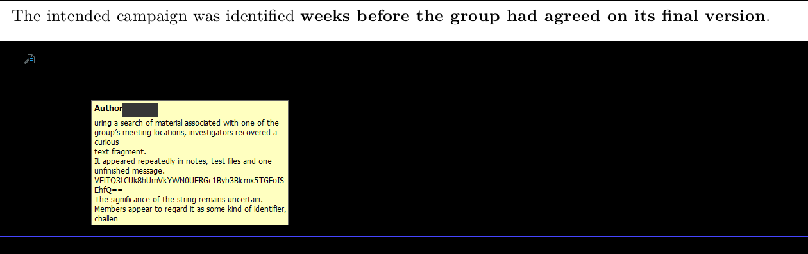

As a psychology student, my habit with a document is to read it. Here I had to stop reading the page and look at what the file actually held. It was a gentle first level, and a good way into that idea.

## The challenge

> As part of ongoing transparency efforts, files containing information on The Singularity's whereabouts will be declassified and released to the public. Rest assured that any sensitive information will be redacted to protect active investigations, innocent people, and matters of security.

The attached file is a government-style PDF, "Analytical Note 26-091". Several paragraphs are covered by solid black rectangles that look like standard redactions.

## Extract the text layer

Rendering the PDF as an image shows black bars over parts of sections 1, 2, 4, 5, 8, 9, 10 and 11. Those bars are separate drawing objects sitting on top of the text, and the text underneath was never removed. When I pulled the text layer directly, every word was still there.



*The hidden text surfaced in my PDF viewer, base64 string and all.*

:::concept{id="pdf-redaction-failure" title="Cosmetic PDF redaction"}
A PDF's visible page is a set of rendering instructions, and the text lives in a separate layer underneath. Drawing a filled black shape on top hides the words on screen but does not delete or flatten them, so any tool that reads the text layer recovers everything. Real redaction removes the underlying objects or flattens the page to an image. This exact mistake has leaked information from law firms, courts and government agencies.
:::

Section 6, titled "The Flag", has no black box over it at all. It just sits there with a string that looks like base64:

```text
VElTQ3tCUk8hUmVkYWN0UERGc1Byb3Blcmx5TGFoISEhfQ==
```

## Decode the base64 string

:::concept{id="base64-encoding" title="Base64"}
Base64 maps every three bytes onto four printable characters, so binary data can travel inside plain text. It's an encoding with no key, so anyone can decode it. A trailing `=` is padding. A long run of letters, digits and `+`/`/` ending in `=` is a good hint to try decoding it.
:::

```python
import base64

encoded = "VElTQ3tCUk8hUmVkYWN0UERGc1Byb3Blcmx5TGFoISEhfQ=="
flag = base64.b64decode(encoded).decode()
print(flag)
```

Output:

```text
TISC{BRO!RedactPDFsProperlyLah!!!}
```

The flag says it better than I can. The black boxes were only cosmetic, so the same flaw would have exposed any of the other covered sections if they had held anything sensitive. If you redact a PDF, delete the text or flatten the page.

## Solve script

The whole thing is [decode.py](/code/redacted/decode.py).

```python
import base64

encoded = "VElTQ3tCUk8hUmVkYWN0UERGc1Byb3Blcmx5TGFoISEhfQ=="
print(base64.b64decode(encoded).decode())
```
