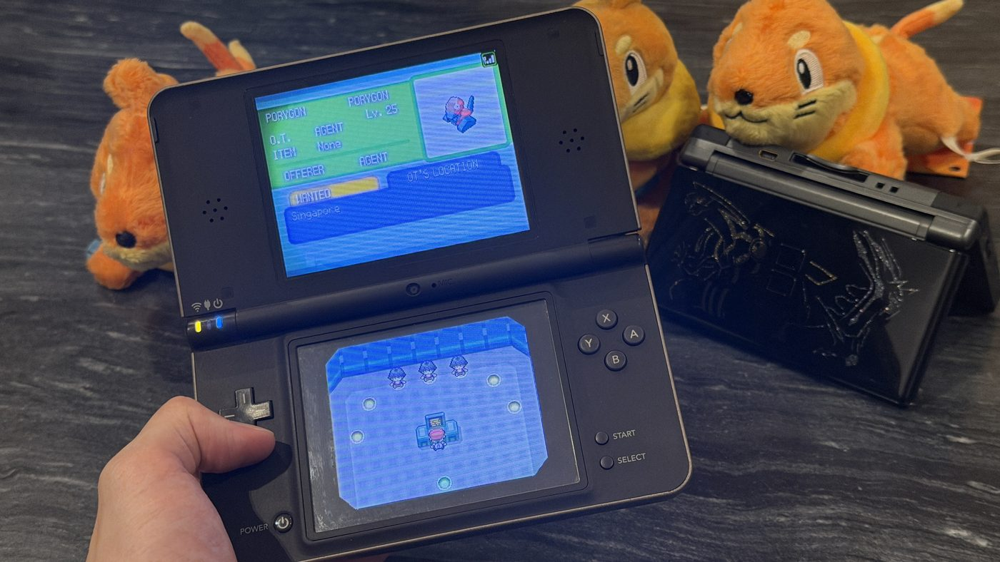
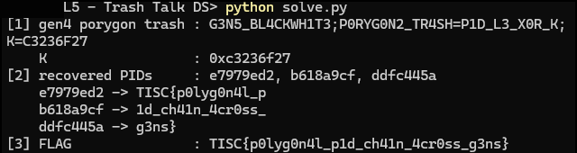

I grew up more comfortable reading people than reading packet captures, so a challenge that turned out to be part protocol archaeology and part Pokémon nostalgia was a strange sort of gift. It was also the first time I treated a dead game server as a spec worth getting exactly right.

## The challenge

> The Singularity's agents have been passing messages that we urgently need to intercept. We've traced their traffic to http://chals.tisc26.ctf.sg:31259/. They seem to be taking it chill though, seemingly playing Pokémon Platinum. Counter-intelligence has snapped a picture that could help us.

The only attachment was a photo of a Nintendo DS. The server at `chals.tisc26.ctf.sg:31259` is a faithful re-implementation of the discontinued Nintendo Wi-Fi Connection GTS, the online trading service Pokémon games used around 2007. Nintendo ran the original and never documented it publicly. What exists today is the reverse-engineering and reimplementation that retro-gaming hobbyists did years later.

## Learning it fast

None of this was familiar ground. I had never touched DS Wi-Fi internals, the GTS wire format, or the idea of trash bytes in a save file. To move quickly I leaned on Claude and ChatGPT to get up to speed on the DS/GTS save formats and how trash bytes work. They summarised the Pokémon save-record layout, the GTS token-and-hash exchange, and the two community write-ups so I could see where they agreed and where they didn't. Deciding what actually mattered was my job, and it kept coming back to the same instinct, which was to distrust the labels.

The challenge is full of misdirection. What a record advertises in its metadata is not what it contains. In stage 2, two of the five Porygon2 results are decoys. Their GTS metadata claims species 233, but decrypted they are a Ditto nicknamed `NOT ME!` with all-zero trash, which would have handed me `K` back as a phantom PID. In stage 3, only the outer envelope of a trade offer is checked, not the Pokémon inside it, and that gap is what the whole exploit rides on. Every trap on this level had the same shape, so I learned to trust the verified content and never the claim wrapped around it.

## Get past the invisible gate



*The organiser's counter-intelligence photo: a GTS listing offering a Porygon (Lv.25, trainer AGENT, Singapore), Buizel plushies behind the DS.*

Every normal request returned a generic IIS 404. The photo showed a DS on Pokémon Platinum's GTS screen, which points at that game's online host. The service is gated on the HTTP Host header matching the exact hostname the original hardware used, and nothing else. Set it and the paths that had 404'd started returning `Bad request`, so the handlers were live underneath.

:::concept{id="host-header-gating" title="Host-header gating"}
The Host header normally just says which website you are asking for. Here it works as a lock. With any other value the service returns 404s, and only `Host: gamestats2.gs.nintendowifi.net` routes the real endpoints. A whole service sat behind a header value most scanners never set.
:::

```python
def _http(path):
    c = http.client.HTTPConnection(*TARGET, timeout=25)
    c.putrequest("GET", path, skip_host=True, skip_accept_encoding=True)
    c.putheader("Host", HOST)                  # the whole trick lives here
    c.putheader("User-Agent", "Nintendo DS")
    c.endheaders()
    r = c.getresponse(); d = r.read(); c.close()
    return r.status, d
```

## Reconstruct the protocol

Each request is a two-step conversation. You fetch a short-lived 32-character token, then submit the real request with `hash=sha1(salt+token)`, plus a urlsafe-base64 `data` blob. That blob is `[obfuscated checksum:4] + body`, where the checksum is the byte sum of the body XOR a per-service mask. For Gen 4 the body is wrapped again in a keystream cipher seeded from that checksum.

:::concept{id="challenge-response" title="Challenge-response handshake"}
Instead of a static password, the server hands out a one-time token and only proceeds when the client answers with `sha1(salt + token)`. The salt is a fixed constant shipped on every cartridge, so this isn't strong authentication. All it does is tie a request to a fresh token, so you have to fetch one first rather than replay an old blob verbatim.
:::

:::concept{id="lcg-keystream" title="LCG keystream"}
Two separate ciphers are in play. A Gen 4 GTS request is XORed byte by byte with a keystream (`seed*0x45 + 0x1111 mod 2^31`) seeded from the request's checksum. Separately, each Pokémon blob is scrambled with the games' own LCRNG (`0x41C64E6D`, `0x6073`), seeded from the blob's 16-bit checksum, with its four 32-byte data blocks shuffled into an order set by the PID. Reconstruct the constants for each and both unwind cleanly.
:::

I cross-referenced two community write-ups ([mm201's pkmn-classic-framework wiki](https://github.com/mm201/pkmn-classic-framework/wiki/gamestats2-server) and the [Furlock's Forest protocol notes](https://web.archive.org/web/20240811211856/http://www.furlocks-forest.net/wiki/?page=Pokemon_GTS_Protocol), via the Wayback Machine since the site is gone) to pin the packing format down rather than guess at it.

## Follow the trash bytes through three stages

Each Pokémon record reserves 22 bytes for a nickname. A nickname shorter than that leaves the remainder as leftover trash, and the challenge planted meaning there.

:::concept{id="trash-bytes" title="Trash bytes"}
When a fixed field holds a short string, the bytes after the `FFFF` terminator aren't used by the game. In real saves they hold leftovers or a fill pattern, and here the challenge planted its data there. The real content lives past the terminator.
:::

**Stage 1.** Searching species 137 (Porygon) on Gen 4 returns 292-byte records. The nickname field decodes through Gen 4's own character table rather than UTF-16, so my script ignores it and reads the trash bytes straight from a fixed offset. Ordering the ten fragments by the deposit-timestamp byte at offset `0xF9` spells a hint string ending in a per-instance key:

```
G3N5_BL4CKWH1T3;P0RYG0N2_TR4SH=P1D_L3_X0R_K;K=F62ECE7B
```

`K` is randomised per instance, so I read it from the traffic rather than hard-coding it.

**Stage 2.** Searching Gen 5 for species 233 (Porygon2) returns five records. Three carry four trash bytes each, a target PID little-endian XOR `K`. The other two are decoys whose metadata claims species 233 but decrypt to a Ditto nicknamed `NOT ME!` with all-zero trash, which would hand back `K` as a phantom PID. So I filtered on the decrypted species rather than the metadata.

:::concept{id="decoy-discipline" title="Decoy discipline"}
The `NOT ME!` records exist to catch anyone who trusts the outer label. The habit that saved me here, and again in later levels, was to believe the verified content and never the claim wrapped around it.
:::

**Stage 3.** `exchange.asp` validates only the outer GTS metadata of an offer, not the Pokémon nested inside it. So the cheapest valid trade was a real search record with three bytes rewritten: species 418 (Buizel), gender male, level 35. The Buizel came straight from the plushies in the photo, and among the variations I probed, only male Buizel at levels 30 to 40 was accepted. Each successful trade returns a Porygon-Z whose 16 trash bytes are a flag fragment XORed with that Porygon-Z's own PID. Three fragments, ordered by the same `0xF9` byte, join up into the flag.

```python
def stage3(target, level=35):
    mypid, recs = search(GEN5, PORYGON2, 296, skip=2)  # server wants a recent search
    rec = bytearray(recs[0])
    rec[0xEC:0xEE] = struct.pack("<H", BUIZEL)         # offered species
    rec[0xEE] = 1                                      # gender: male
    rec[0xEF] = level                                  # level: 30-40 inclusive
    st, d = call(GEN5, "/worldexchange/exchange.asp", mypid,
                 bytes(rec) + struct.pack("<I", target) + bytes(132))
    pkm = decrypt_pkm(d[:220])
    _, trash = nickname_and_trash(pkm)
    key = pid_of(pkm).to_bytes(4, "little")
    return bytes(b ^ key[i % 4] for i, b in enumerate(trash)).rstrip(b"\x00")
```

## Run it

```text
[1] gen4 porygon trash : G3N5_BL4CKWH1T3;P0RYG0N2_TR4SH=P1D_L3_X0R_K;K=F62ECE7B
    K                  : 0xf62ece7b
[2] recovered PIDs     : e7979ed2, b618a9cf, ddfc445a
    e7979ed2 -> TISC{p0lyg0n4l_p
    b618a9cf -> 1d_ch41n_4cr0ss_
    ddfc445a -> g3ns}
[3] FLAG               : TISC{p0lyg0n4l_p1d_ch41n_4cr0ss_g3ns}
```



*My run of the full solve, from cold, printing the assembled flag. This screenshot is a different run from the text above, so `K` reads `C3236F27` here; `K` is random per instance, while the PIDs and flag are the same.*

The full solve, with no hard-coded instance values, is in [`solve.py`](/code/trash-talk-ds/solve.py).

:::result{title="Flag"}
`TISC{p0lyg0n4l_p1d_ch41n_4cr0ss_g3ns}`
:::
