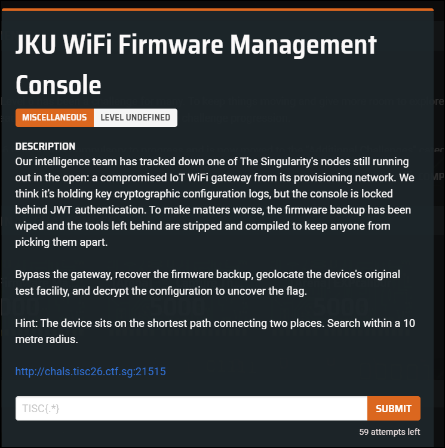
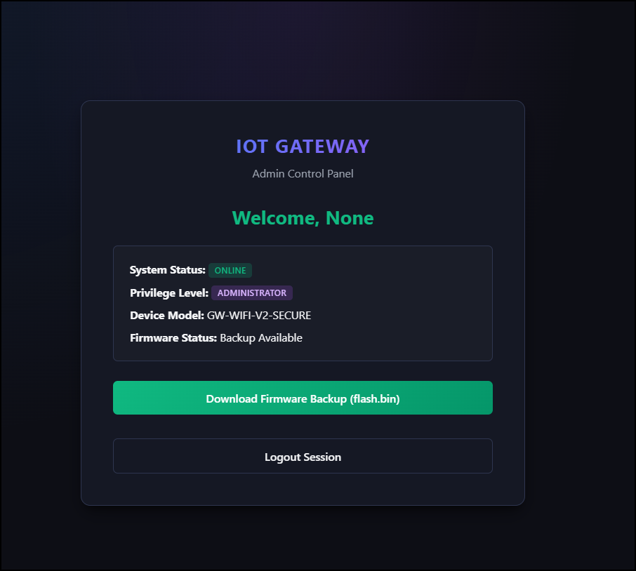
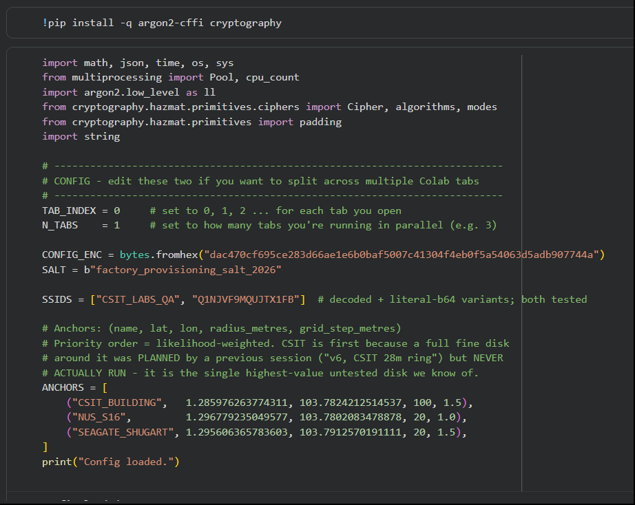
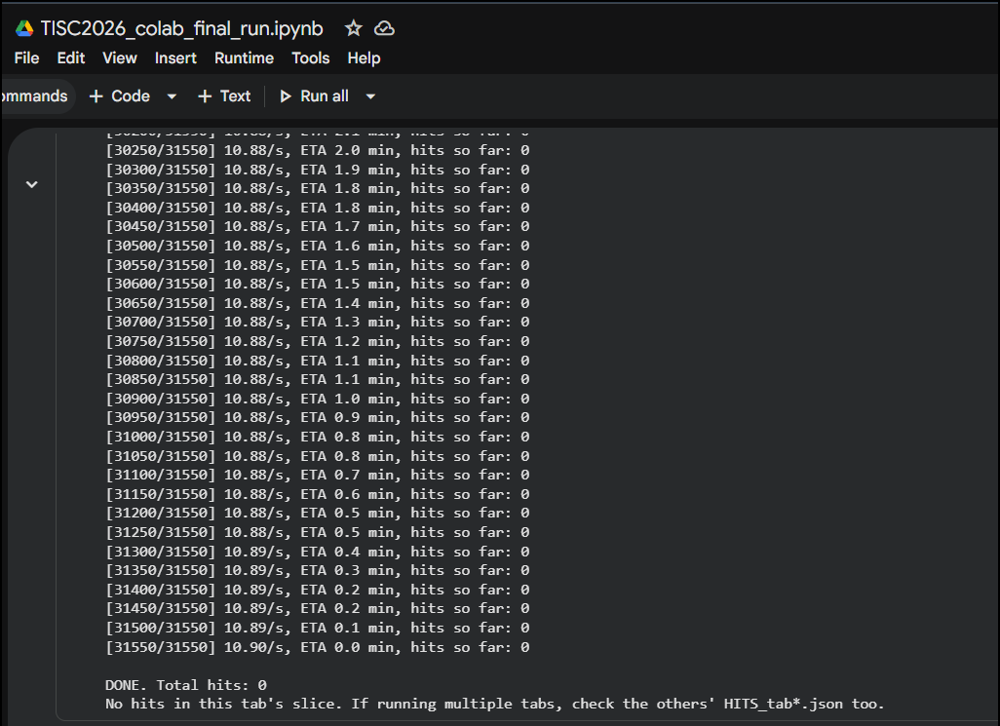
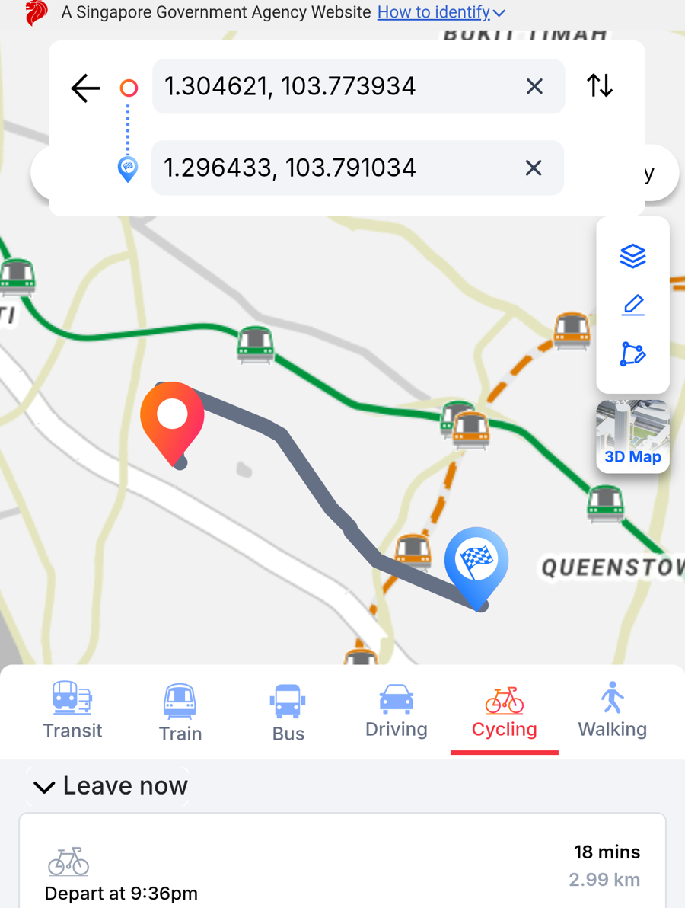
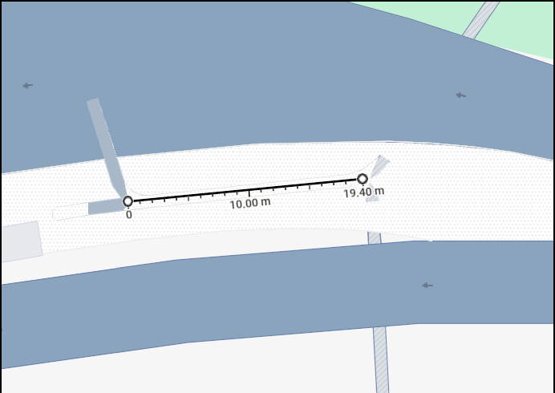
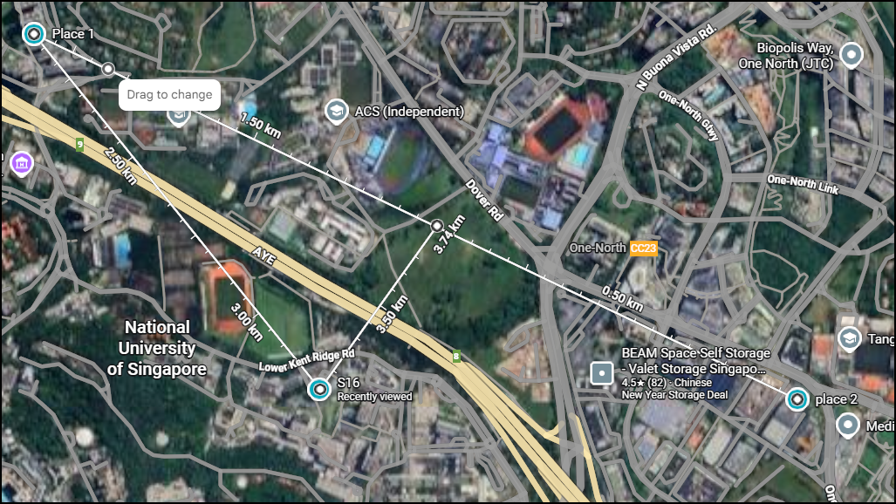
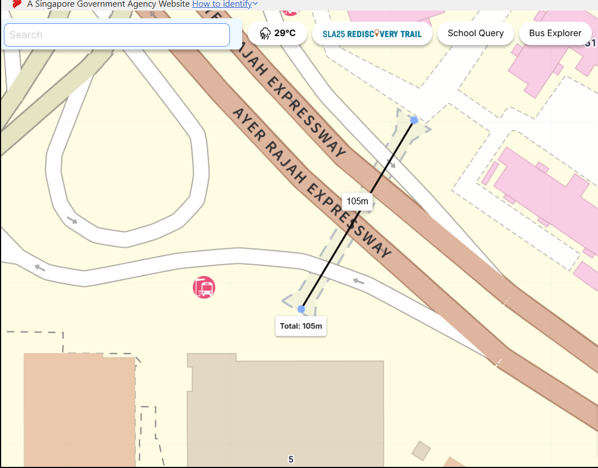

I had the right two places. I had even tested a point 59 metres from the answer, and walked away from it. Everything in this challenge that needed code worked. What I lost was the one part that only needed me to believe the simple version of the clue.

JKU started on the main TISC 2026 ladder. On day three it moved to the Additional Challenges because it was stopping a lot of players, and I can see why. The first three stages are a clean reverse-engineering chain, and the fourth is a geolocation puzzle that punishes you for being clever when it wants you to be literal.


*The card, with the hint and a counter that happened to read "59 attempts left". I would end up 59 metres from the answer, which I only noticed afterwards.*

## The challenge

The brief asks you to bypass the gateway, recover a firmware backup, geolocate the device's original test facility, and decrypt the configuration, which is where the flag sits. The hint reads: "The device sits on the shortest path connecting two places. Search within a 10 metre radius."

## Stages 1 to 3

Stage one is a JWT algorithm confusion bug. The server publishes its RSA public key at `/.well-known/jwks.json` and also accepts HS256, so I used the serialised JWK as the HMAC secret and signed a token with `{"role":"admin"}`. That got me into the admin panel and a "Download Firmware Backup (flash.bin)" button.

:::concept{id="jwt-algorithm-confusion" title="JWT algorithm confusion"}
A server that verifies RS256 with its public key but also accepts HS256 can be fooled. Use the published public key's own bytes as the HMAC secret, sign an HS256 token, and the server checks it against the same key material. Your forged claims verify, so you can make yourself admin.
:::


*Admin, via a token I signed myself.*

Next came unpacking `flash.bin`. It opens with a 9-byte "PFCK" header, and the body is XORed with `0x5A` and then 16-bit byte-swapped. Undo both and you get a SquashFS image holding `config.enc`, a stripped `config_decrypt` binary and `factory_tests.db`.

For the key derivation, I confirmed the format with `ltrace` on the real binary rather than guessing from the disassembly. The password is built as:

```python
password = "%.6f,%.6f_%s" % (lat, lon, ssid)
```

The `ssid` is `CSIT_LABS_QA`, stored base64 as `Q1NJVF9MQUJTX1FB`. That password feeds Argon2id with salt `factory_provisioning_salt_2026`, `t=10`, `m=262144` KiB (256 MiB), `p=4`, and a 48-byte output. The first 32 bytes are the AES key and the last 16 are the IV. The cipher is AES-256-CBC with PKCS7 over `config.enc`.

:::concept{id="argon2id" title="Argon2id"}
Argon2id is a memory-hard password hash. With 256 MiB and ten passes, each candidate takes roughly a second on real hardware, and that is the whole difficulty of stage four. You can't grind millions of coordinates, so the coordinate space has to be small before you start.
:::

On 28 September I ran a positive control. I encrypted a known message with my own Python pipeline and handed it to the real binary, which decrypted it to `TISC{positive_control_ok}`. From then on, a wrong guess really was a wrong guess and not a broken script.

:::concept{id="positive-control" title="Positive control"}
If your method cannot recover an answer you planted yourself, its failure on the real target tells you nothing. A passing positive control is what lets you read a null result as "that coordinate is wrong" instead of "my code is broken".
:::

## Stage 4: the coordinate

The password needs the exact `lat` and `lon` the device was provisioned with. Get them right and config.enc decrypts to the flag. Get them wrong and you get garbage with broken padding, after Argon2id has made you wait about a second to find out.

:::result{title="What a miss looks like"}
I used `1.234567, 103.456789` as a test coordinate while building the pipeline. It decrypts `config.enc` to 32 bytes of noise, `9ef6991d01ccf2c976b1fe970044a90d44bde024cf118473c78975db4ab955ce`, with broken padding and nothing printable. The real coordinate gives `TISC{jku_f0r3ns1cs_w1gl3_4ha}`. There is no partial credit and no "getting warmer". A guess 59 metres off looks exactly like a guess on the other side of the world, so you can't feel your way towards the answer.
:::

The clue file showed two faint readings, `SYS.LOC 1.304621,103.773934 (CALIBRATING)` and `GPS_RAW 1.296433,103.791034 (ACC 85%)`, plus a line reading `DEVICE SITE: NUS S16`. So I had two coordinates on screen, a named site, and an SSID that named an organisation. I spent days deciding which two places the hint meant and how finely to search between them, and I had the right answer in two different files along the way.

## Trying WiGLE

WiGLE was the last lead I chased. By then I had tried almost everything else, and the SSID was the most concrete thing the challenge had handed me. WiGLE is a public database of Wi-Fi network names and where they've been seen. If `CSIT_LABS_QA` had ever been logged near S16, it would give me a location, and the 10 metre radius would read as ordinary GPS error.

I made an account on 20 September.


*Verified and ready to find nothing.*

Then I searched for the exact name, and for wildcard versions. Both searches for `CSIT_LABS_QA` came back empty:

```json
{"success":true,"totalResults":0,"resultCount":0,"results":[]}
```

Broader `CSIT` searches only turned up unrelated networks elsewhere. With no sighting there was no position to refine, and that's when I decided WiGLE was a decoy. A network that only exists inside a challenge has never been seen by anyone.

## How close I got

Across roughly twenty sessions and about US$50 of Google Colab compute, I tested more than 340,000 coordinates. I even paid for a TPU v6 runtime, the fastest Colab offered me, which is funny in hindsight because Argon2 runs on the CPU and never touches the TPU. If brute force was a flag, mine would have been `brute_force_is_not_my_weakness`. This is how near each search landed.

| Search | Closest it got to the answer |
| --- | --- |
| v4 notebook's S16–CSIT line (saved 18 Sep, never run) | 35 m |
| OneMap cycling-route vertex, S16 to CSIT (19 Sep) | 59 m |
| Final Colab run (100 m ring around CSIT, plus S16 and Shugart) | ~373 m |
| Big 337,650-candidate notebook (disks + readings line) | ~460 m |
| Named place CSIT | 473 m |
| AYE pedestrian tunnel sweep | 572 m |
| Named place S16 | 755 m |
| Line between the two printed readings | 1,063 m |

The top two rows hurt the most. On 19 September a sweep of 33 OneMap routes between my named places ran to completion: 2,052 unique route vertices, tested under `CSIT_LABS_QA`, with zero hits. One of those vertices, on the cycling route from S16 to CSIT, was 58.96 metres from the answer by haversine, with the answer about five grid steps due west. I tested it as a single point and moved on.

:::result{title="The 59 metre miss"}
Tested vertex: `1.290180, 103.782430`. Answer: `1.290200, 103.781900`. Distance: 58.96 m, same latitude to four decimals. I had the point, and I searched it as a point instead of as the centre of a small grid, which is exactly what "within a 10 metre radius" was asking me not to do.
:::

A day earlier, on 18 September, my v4 Colab notebook already contained the straight S16-to-CSIT line, whose closest point was 35 metres from the answer. Nineteen minutes after saving it, I replaced it with v5, a cheaper plan centred on S16 that dropped the CSIT line. The v4 notebook never ran.

My last Colab notebook went wide around the named buildings: a 100 metre ring around CSIT at 1.5 metre steps, 20 metre rings around S16 and the Shugart building, and both spellings of the SSID. That came to 31,550 candidates. It ground through them at about 11 guesses a second for roughly 48 minutes and finished with `DONE. Total hits: 0`. The answer was about 373 metres outside the CSIT ring. At that speed, the winner's 834 points would have taken my notebook about 77 seconds.



*The final run's anchors. Big careful rings around single buildings, and no corridor.*



*Forty-eight minutes of this.*

## Why I missed it

The biggest cost was a precision assumption. The password format is `%.6f`, so I assumed the coordinate had six decimal places. At six decimals a corridor band between two places is millions of points, and on 28 September I wrote the corridor sweep off as infeasible. The coordinate actually had only four decimal places. A 0.0001 degree step is about 11 metres, which is what "10 metre radius" was really pointing at, and at four decimals the corridor was 834 points. I killed the one search that would have worked by sizing it at the wrong resolution.

:::concept{id="hint-granularity" title="Let the hint set the grid"}
A radius in a clue tells you the step the setter expects. Ten metres is roughly 0.0001 degrees, or four decimal places. I let the `%.6f` format talk me into six, and a small search became an impossible one.
:::

I also anchored on the decoys. For days I read "two places" as the two printed GPS readings, which are literally labelled `CALIBRATING` and `ACC 85%`. The S16–CSIT line kept turning up in my own notes, and every time I used it to score other candidates, never as a band to sweep.



*I asked OneMap for the shortest path between the two decoy readings, by bike, on foot, by bus and by train. Every route was carefully measured, and every one ran between the wrong two places.*

:::concept{id="decoy-discipline" title="Decoy discipline"}
Data that labels itself unreliable is doing you a favour. The two places the challenge actually named, the site and the organisation, were in plain text the whole time.
:::

Then there was the tunnel. I was convinced stage 4 was an OSINT puzzle, and "shortest path connecting two places" sounded to me like a real path between two real places. DSO National Laboratories sits on the Science Park side of the AYE, one-north (Fusionopolis) is on the other, and a newly built pedestrian tunnel runs under the expressway between them. I spotted it in a LinkedIn video, confirmed it on OpenStreetMap, and built a whole story around it.

Then I measured along the tunnel's footway, and the map's ruler showed a 10.00 m tick. Search within a 10 metre radius! I was very excited for several minutes. It was a coincidence. The tunnel was 572 metres from the answer, and the plain reading, a line between the site and the org, sat underneath my lovely theory the entire time.



*A 10.00 m tick on the ruler. I may have gasped. It meant nothing.*

The part that stings is that some of my instincts were right. I said early on that this wasn't a brute-force problem, and the real search was 834 points. My WiGLE call was right too. After the $50 of compute I called a halt because everything had been tested to death. Those searches were exhausted. The problem wasn't. Claude (for the scripting) and ChatGPT (for brainstorming) carried the same six-decimal assumption and the same anchoring that I did, so we were confidently wrong together. I was the one driving, though.

## What the winner saw

The answer is `1.290200,103.781900`, which with `CSIT_LABS_QA` gives `TISC{jku_f0r3ns1cs_w1gl3_4ha}`. I got there after the event closed, from the public writeup by [Hrithik Ram Ganesh Kumar](https://hrithikram.hrithikramg.workers.dev/#/tisc26/jku), one of the top five finishers. His reading of the puzzle is the one I kept not committing to.

His two places were the two the challenge names outright: NUS S16 as the device site, and CSIT from the SSID, about 1.2 km apart. He read the coordinate as four decimals to match the radius, took every four-decimal grid point within 40 metres of the S16–CSIT segment (834 candidates), and ran them through the same Argon2id pipeline. The flag came out at candidate 596, in minutes.

:::concept{id="corridor-sweep" title="Corridor sweep"}
Instead of scoring a few named points against a line, you test every grid point within a fixed distance of it, at the grid's own step. It's the search I named, declared infeasible at the wrong precision, and never ran.
:::

He hit the WiGLE dead end too, with zero observations. The flag text `w1gl3_4ha` reads as "WiGLE, aha", which I read as the setter's joke that the WiGLE lead was built to go nowhere. It was the last lead I chased, and one I crossed off correctly.

## What I'm taking away

Next time I'll let the hint set the grid step before calling anything too big, sweep a band around a path instead of testing the points a tool hands back, and give the plain reading a fair go, especially when the elaborate one is more fun. I had the two right places and the two right files. Where it fell apart was how I searched between them.


*The decoy triangle. I let these three pins define the problem for too long, and two of them were labelled unreliable.*


*The AYE tunnel theory, measured on OneMap. Good OSINT, 572 metres from the answer.*
